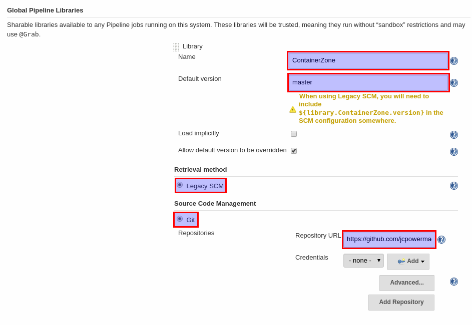

### ContainerZone Pipeline Library

Status: ALPHA; do not use unless you know what you are doing.


### Using Example

NOTE: This project currently can only be used internally

```
oc new-project ContainerZone
oc create -f https://raw.githubusercontent.com/jcpowermac/containerzone-pipeline-library/master/example/sample-ocp-pipeline.yaml
```

Modify the pipeline to include the correct `secret`, `projectid` and `dockerImageDigest`.
```
oc edit bc/sample-pipeline
```

#### Add Global Pipeline Libraries

In Jenkins > Manage Jenkins > Configure System



```
# Library
Name: ContainerZone
Default version: master

# Retrieval method
Use: Legacy SCM

# Source Code Management
Use: Git

# The current respository, this may change in the future
Repository URL: https://github.com/jcpowermac/containerzone-pipeline-library
```
Click save

Now the pipeline can be started...

```
oc start-build sample-pipeline
```


#### Asciinema...

Example output in a console this will be in Jenkins though...
[](https://asciinema.org/a/104894)
