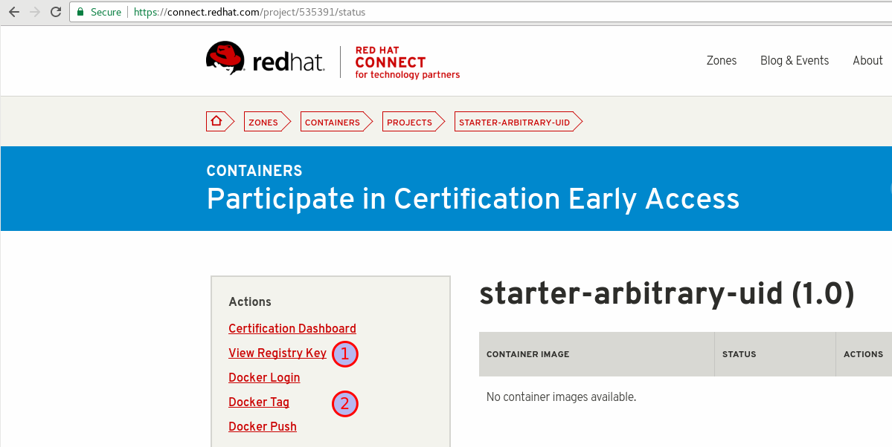
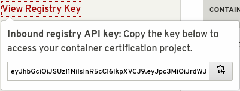
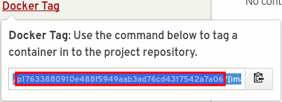
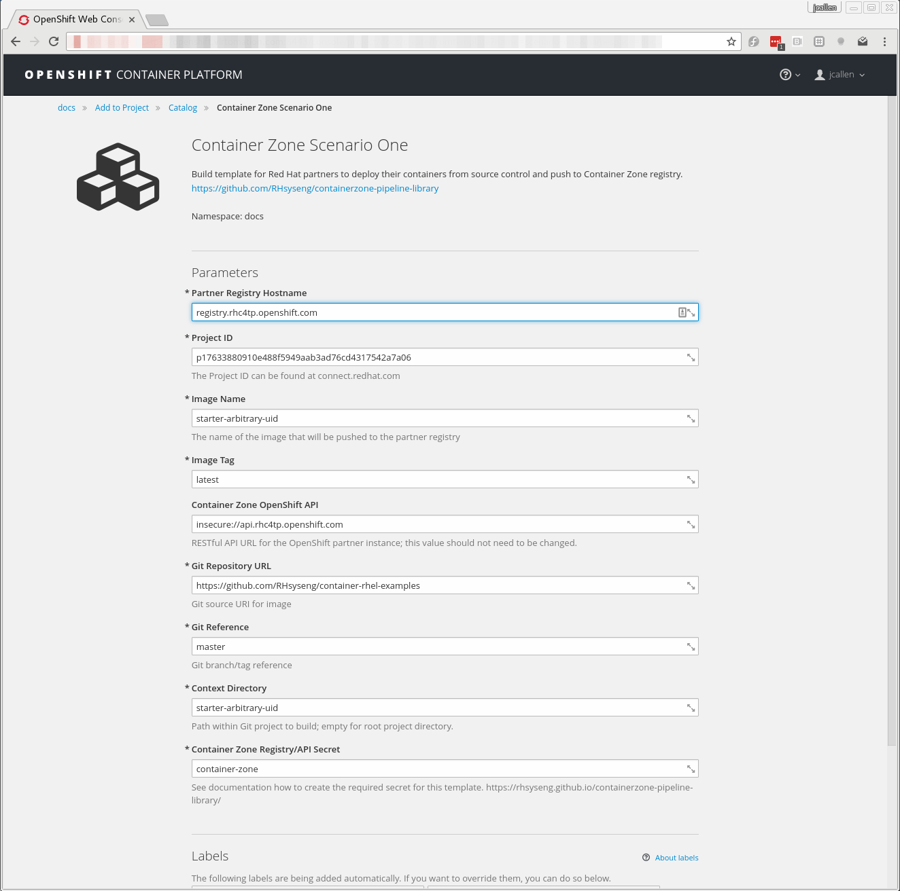

= Using Red Hat Container Zone pipeline library
Joseph Callen
:toc:

[[Introduction]]
== Introduction

[NOTE]
====
The procedure below only works in on-premise or dedicated OpenShift
environments.
====

=== Get Project ID and Registry Key

To get started we need to get two specific values before continuing.

=== Scenario One
.Using OpenShift and Jenkins Without a Existing Project

The first scenario is an example when a partner is not currently using OpenShift or Jenkins to build their container image.
In this section we will walk through setting up a new project, adding Jenkins and finally the scenario one template.

==== Deploying Jenkins

The pipeline and the library require additional plugins which are not included
in the default Jenkins. The project includes a modified template with a
source-to-image build of Jenkins to include the required plugins.

[source]
....
oc new-project partner-a
oc process -f https://raw.githubusercontent.com/RHsyseng/containerzone-pipeline-library/master/jenkins/jenkins-ephemeral-template.yaml | oc create -f -
....

==== Configuring Secrets

Pushing to the Container Zone registry and the API require authentication.  The project id and registry key are provided on the project page.

[source]
....

oc secrets new-dockercfg container-zone --docker-email='your@email.com' --docker-password="${REGISTRY_KEY}" --docker-username='${PROJECT_ID}' --docker-server='registry'
....

Both the BuildConfig and the ImageStreamTag (created in the pipeline with
ImageStreamImport) require authentication to the registry. Adding the
container-zone secret to the default service account provides this access.

[source]
....
oc secrets add serviceaccount/default secrets/container-zone --for=pull,mount
....

==== Using the Template

Let's first import the template using the `oc create` command.
[source]
....
oc create -f  https://raw.githubusercontent.com/RHsyseng/containerzone-pipeline-library/master/example/scenario-one-template.yaml
....

After the template has been imported we can use the web interface to deploy the template.

== Appendix
[appendix]

=== Example Jenkins Pipeline using Docker

[source,groovy]
....
#!groovy

@Library('ContainerZone')                                                               <1>
import com.redhat.connect.*

node {
    stage('checkout') {                                                                 <2>
        checkout scm
    }

    dockerBuildPush {                                                                   <3>
        credentialsId = "container-zone"
        contextDir = "examples/docker"
        imageName = "czone"
        imageTag = "latest"
    }

    def dockerDigest = getDockerDigest {                                                <4>
        openShiftUri = "insecure://api.rhc4tp.openshift.com"
        imageName = "czone"
        imageTag = "latest"
    }

    containerZoneScan([credentialsId: 'container-zone', dockerDigest: dockerDigest])    <5>
}
....

<1> Use the library defined in Global Pipeline library and import.
<2> Checkout source
<3> The https://github.com/RHsyseng/containerzone-pipeline-library/blob/master/vars/dockerBuildPush.groovy[dockerBuildPush.groovy] step.  This step
uses credentials to authenticate to the remote registry.  Builds the docker image and pushes
the image to the registry.
<4> The https://github.com/RHsyseng/containerzone-pipeline-library/blob/master/vars/getDockerDigest.groovy[getDockerDigest.groovy] step.  This step uses credential
to access the remote OpenShift API to retrieve a ImageStreamTag and return the docker image digest.
<5> The https://github.com/RHsyseng/containerzone-pipeline-library/blob/master/vars/containerZoneScan.groovy[containerZoneScan.groovy] step. This step uses credential
to access the Container Zone API.  It will wait for the scan to complete and print the results of the scan.

[appendix]
=== Jenkins Pipeline Links

* https://jenkins.io/doc/book/
* https://jenkins.io/doc/book/pipeline
* https://jenkins.io/doc/book/pipeline/shared-libraries/
* https://jenkins.io/doc/book/pipeline/
* https://jenkins.io/doc/book/pipeline/syntax/
* https://jenkins.io/doc/pipeline/steps/

